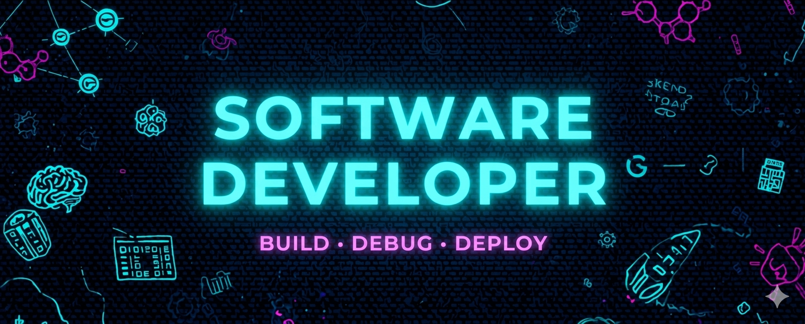

<h1 align="center">Hi 👋, I'm Abhinav Chandra</h1>

  

- 🔭 I’m currently working on **E-commerce app**

- 🌱 I’m currently learning **Django**

- 📫 How to reach me **abhinavcanichandran@gmail.com**

<h3 align="left">Connect with me:</h3>

<h3 align="left">Languages and Tools:</h3>

                   

  
  
  &nbsp;&nbsp;&nbsp;
  

